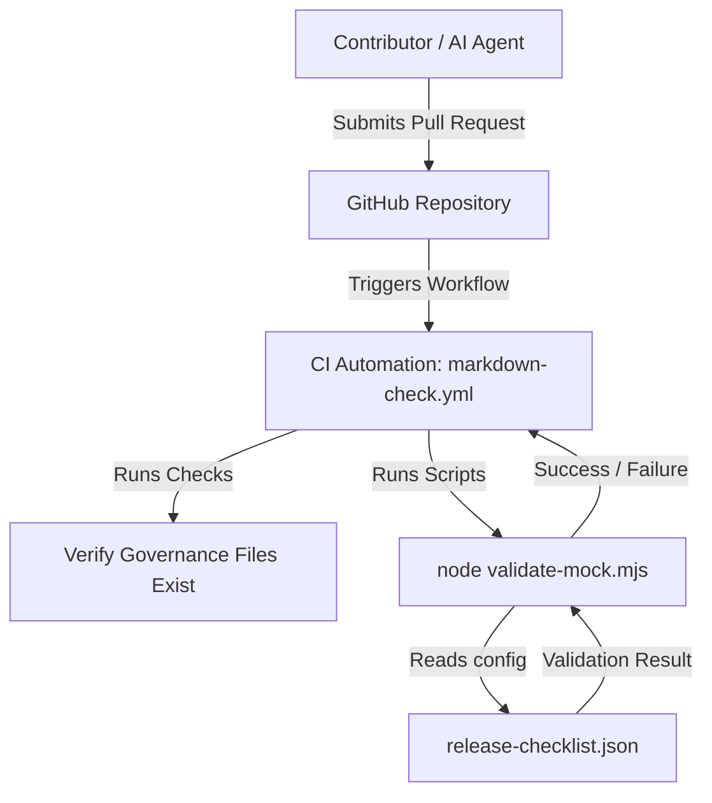

# MTQ-V

MTQ-V is a public documentation and governance repository for safe AI-assisted project maintenance. It is designed for open-source maintainers and collaborators who want to establish clear security boundaries, release-readiness checklists, and rules for AI coding agents. To get started, clone the repository, review the documentation files, and run the mock release checklist validation script described in the Quickstart section below.

## Prerequisites

Before running the verification scripts, ensure you have:
- **Node.js**: v18.0.0 or higher (for ESM module support).
- **Git**: For version control.
- **Environment Configuration**: Check `.env.example` for placeholder values.
  - `PUBLIC_PROJECT_NAME`: The name of the public project.
  - `PUBLIC_DATA_POLICY`: Set to `mock-only` to restrict data access.

## Quickstart

1. **Clone the repository**:
   ```bash
   git clone https://github.com/Allen-Zhi-Ming/MTQ-V.git
   cd MTQ-V
   ```

2. **Run the mock release-readiness checklist validation script**:
   ```bash
   node examples/release-checklist-mock/validate-mock.mjs
   ```
   *Expected output*:
   ```
   Release checklist mock validation passed
   ```

3. **Run the mock documentation review validation script**:
   ```bash
   node examples/documentation-review-mock/validate-docs.mjs
   ```
   *Expected output*:
   ```
   Documentation review mock validation passed
   ```

## Purpose

- Provide a clean, public surface for open-source review.
- Document safe collaboration rules for AI coding agents.
- Demonstrate non-destructive documentation maintenance.
- Track release-readiness and project governance practices.
- Support future Codex for Open Source application materials.

## Current status

This repository is a documentation-first public foundation. It does not import or contain production code.

## Repository map

- `CONTRIBUTING.md`: Contribution rules.
- `SECURITY.md`: Security reporting policy.
- `AGENTS.md`: AI agent guide.
- `CHANGELOG.md`: Project version history.
- `.env.example`: Placeholder environment configuration.
- `docs/architecture.md`: Architecture notes.
- `docs/scope.md`: Public scope boundary.
- `docs/maintenance-plan.md`: Maintenance rhythm.
- `docs/public-release-notes.md`: Release notes.
- `docs/codex-oss-application.md`: Codex OSS application draft.
- `docs/codex-oss-final-application.md`: Final Codex OSS application.
- `docs/mock-data-policy.md`: Mock data usage guidelines.
- `docs/mock-example-plan.md`: Plan for future public-safe examples.
- `docs/review-checklist.md`: Review checklist before publishing updates.
- `examples/release-checklist-mock/`: Public-safe release-readiness checklist mock example.
- `examples/documentation-review-mock/`: Programmatic validation of documentation coverage mock example.

## Public safety boundary

### Included

- Public documentation.
- Placeholder examples.
- Maintenance and review notes.

### Excluded

- Production `.env` files.
- API keys or service-role credentials.
- Private database URLs.
- Real user data.
- Private prompts.
- Commercial workflows.
- Payment or entitlement logic.
- Private repository history.

## License

This project is licensed under the MIT License. See `LICENSE` for details.

---

## Architecture notes

MTQ-V is currently a public documentation and governance foundation. It establishes the rules, templates, and safety boundaries before production assets are added or reviewed.

### System components

The project is structured into four main components:

1. **Governance & Guidelines**: Files like `AGENTS.md` and `SECURITY.md` define the rules, safety boundaries, and operating limits for developers and AI assistants.
2. **Verification & Testing Scripts**: Programmatic validators (e.g., `validate-mock.mjs`) that inspect data templates without loading external dependencies or production code.
3. **Configuration & Data Mocking**: Schema configurations (e.g., `release-checklist.json` and `.env.example`) that demonstrate usage using simulated/placeholder data only.
4. **CI/CD Automation**: GitHub Actions workflow (`markdown-check.yml`) that verifies that all required documentation files exist and validation scripts pass successfully on code change.

### Component interaction flow



### Key design decisions

- **Documentation-first surface**:
  - *Decision*: Separate governance files from the live application code.
  - *Rationale*: Restricts public access to production internals (database schemas, proprietary logic, secret prompts) while providing a transparent surface for open-source contributions.
- **Zero-dependency core**:
  - *Decision*: Use native Node.js ESM modules (`import` syntax, `node:fs` prefix) without compiling tools.
  - *Rationale*: Eliminates third-party dependency vulnerabilities and security footprint, keeping the repository light and highly auditable.
- **Strict agentic boundaries**:
  - *Decision*: Establish the `AGENTS.md` framework listing protected files.
  - *Rationale*: Prevents automated AI coding systems from modifying critical legal, security, or core architectural files without human oversight.

### Extension points

#### 1. Adding a new validation example
To expand code verification, add a new directory under `examples/` containing:
- A local `README.md` explaining the example.
- A simulated JSON dataset (e.g., `mock-data.json`).
- A validator script written in native JavaScript (ESM, ending in `.mjs`).

Add verification steps in `.github/workflows/markdown-check.yml` under the validation steps:
```yaml
      - name: Validate new example
        run: |
          node examples/new-example/validate.mjs
```

#### 2. Expanding governance scope
To add new documentation files (e.g., specific deployment guides or additional governance policies):
1. Place the markdown file in the `docs/` directory.
2. Register the file in `docs/scope.md` under the "Included now" section.
3. Add the file and its brief description to the Repository Map in the root `README.md`.
