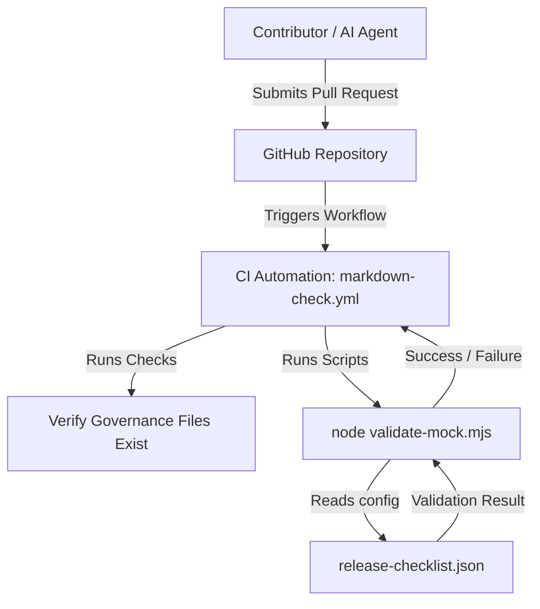

# Architecture Notes

MTQ-V is currently a public documentation and governance foundation. It establishes the rules, templates, and safety boundaries before production assets are added or reviewed.

## System Components

The project is structured into four main components:

1. **Governance & Guidelines**: Files like [AGENTS.md](../AGENTS.md) and [SECURITY.md](../SECURITY.md) define the rules, safety boundaries, and operating limits for developers and AI assistants.
2. **Verification & Testing Scripts**: Programmatic validators (e.g., [validate-mock.mjs](../examples/release-checklist-mock/validate-mock.mjs)) that inspect data templates without loading external dependencies or production code.
3. **Configuration & Data Mocking**: Schema configurations (e.g., [release-checklist.json](../examples/release-checklist-mock/release-checklist.json) and [.env.example](../.env.example)) that demonstrate usage using simulated/placeholder data only.
4. **CI/CD Automation**: GitHub Actions workflow ([markdown-check.yml](../.github/workflows/markdown-check.yml)) that verifies that all required documentation files exist and validation scripts pass successfully on code change.

## Component Interaction Flow

